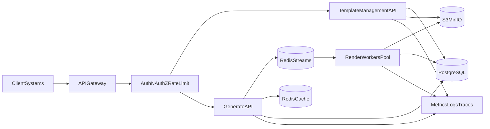

# ADR 0001: Industrial Architecture for DOCX Service v1

## Status
Accepted

## Date
2026-04-18

## Context
Current service architecture is MVP-oriented:
- In-memory stores for templates/versions/jobs/clients.
- JSON file persistence for template metadata and binary payloads.
- In-process async queue and single worker loop.
- No production-grade observability and limited security perimeter.

Business target:
- Production API service for credit/leasing workflows.
- At least 2000 generated documents/day.
- Sub-second generation for agreed sync profile.
- Reliable handling of large, complex DOCX templates (100+ pages).
- Full auditability, security hardening, and async processing.

## Decision
Adopt a modular architecture with durable storage and asynchronous execution:

1. **API layer (FastAPI)**
   - `Template Management API`: documents, versions, tags, conditional blocks, signature slots/assets.
   - `Generation API`: sync and async generation, job status, result retrieval.
   - Shared middleware: authn/authz, rate limiting, idempotency, request tracing.

2. **Data layer**
   - **PostgreSQL** for metadata and audit events.
   - **S3-compatible object storage (MinIO/S3)** for template binaries, generated files, facsimile assets.
   - Strong immutability rule for published document versions.

3. **Execution layer**
   - **Durable queue** (Redis Streams for v1) with retry and DLQ semantics.
   - **Dedicated render workers** separated from API process.
   - Worker pool horizontal scaling for peak handling.

4. **Observability**
   - OpenTelemetry traces.
   - Prometheus metrics.
   - Centralized structured logs with correlation by request/job ID.
   - SLO dashboards (latency, error rate, queue depth, throughput).

5. **Security baseline**
   - OAuth2 client credentials or internal mTLS perimeter.
   - RBAC for template lifecycle operations.
   - JSON schema validation of payloads and strict size guards.
   - Auditable security-sensitive events.

## Architecture Diagram

## Rationale
- PostgreSQL gives transactional guarantees for versioning and audit trails.
- Object storage decouples binary assets from relational metadata and scales better than JSON blobs in DB.
- Queue + workers isolates heavy DOCX processing from request-response APIs.
- Redis Streams is fast to introduce in current stack and supports consumer groups, retries, and dead-letter routing.
- Observability-first approach is mandatory to hold SLOs and detect regressions.

## Consequences

### Positive
- Better reliability and recoverability after restarts/failures.
- Horizontal scalability for generation load.
- Clear path to compliance and operational control.
- Foundation for future online-editor and additional render features.

### Negative
- Increased operational complexity (DB migrations, queue ops, object storage lifecycle).
- More infrastructure components to monitor and secure.
- Requires migration effort from in-memory MVP models.

## Rejected Alternatives
1. **Keep JSON file persistence**
   - Rejected: not suitable for concurrency, durability, and audit requirements.
2. **Single-process async queue**
   - Rejected: poor fault tolerance and scale limitations.
3. **Store binary DOCX in PostgreSQL only**
   - Rejected: higher DB pressure and backup complexity for large binaries.

## Implementation Notes
- Start with dual-write migration adapters from current in-memory model to repository interfaces.
- Introduce migration scripts and explicit schema versioning.
- Gate production cutover behind performance and security checks.
